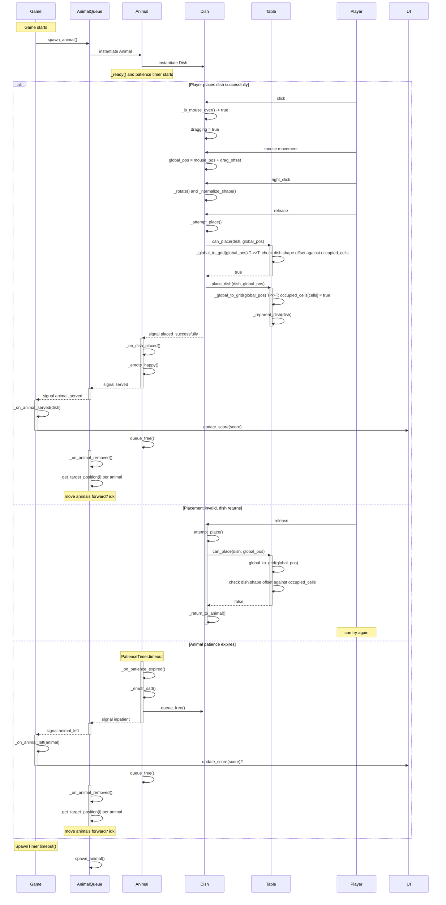

# windstriders-1-bit-jam-13

## Class diagram

```mermaid
classDiagram
    class UI {
        -Label score
        +update_score(score int)
    }

    class Game {
        -int score
        +_ready()
        +_on_animal_served(dish Dish)
        +_on_animal_left(animal Animal)
    }

    class Table {
        -float cell_size
        -float scroll_speed
        -int rows
        -Dictionary~Vector2i&#44; bool~occupied_cells
        +_process(delta float)
        -_global_to_grid(global_pos Vector2) Vector2i
        -_reparent_dish(dish Dish)
        +can_place(dish Dish&#44;global_pos Array~Vector2~) bool
        +place_dish(dish Dish&#44; global_pos Array~Vector2~)
    }

    class Animal {
        -String animal_type
        -float patience
        +_ready()
        +_on_dish_placed()
        +_on_patience_expired()
        +_emote_happy()
        +_emote_sad()
    }

    class Dish {
        +Array~Vector2i~ shape
        -Texture2D texture
        -Sprite2D sprite
        -bool dragging
        -bool is_placed
        -float cell_size
        -Vector2 drag_offset
        +_draw()
        +_input(event InputEvent)
        +_rotate()
        +_normalize_shape()
        +_attempt_place()
        +_return_to_animal()
        +_is_mouse_over() bool
    }

    class DishShapes {
        +Dictionary SHAPES$
    }

    class AnimalQueue {
        -int max_in_queue
        -float spawn_interval
        -im sure im missing some data types here
        -float spacing?
        -float movement_speed?
        +spawn_animal()
        +_get_target_position(index int) Vector2
        +_on_animal_removed()
    }

    Game *-- Table : owns
    Game *-- AnimalQueue : owns
    Game *-- UI : owns
    AnimalQueue o-- Animal : has many
    Animal *-- Dish : has one
    Dish ..> Table : queries placement
    Dish ..> DishShape : reads shape data

    AnimalQueue ..> Game : animal_served
    AnimalQueue ..> Game : animal_left
    Animal ..> AnimalQueue : served
    Animal ..> AnimalQueue : impatient
    Dish ..> Animal : placed_successfully
```

## Sequence diagram

```mermaid
sequenceDiagram
    participant G as Game
    participant Q as AnimalQueue
    participant A as Animal
    participant D as Dish
    participant T as Table
    participant P as Player

    Note over G: Game starts
    G->>Q: spawn_animal()
    Q->>A: instantiate Animal
    A->>D: instantiate Dish

    Note over A: _ready() and patience timer starts

    alt Player places dish successfully 
        P->>D: click
        D->>D: _is_mouse_over() -> true
        D->>D: dragging = true
        P->>D: mouse movement
        D->>D: global_pos = mouse_pos + drag_offset
        P->>D: right_click
        D->>D: _rotate() and _normalize_shape()
        P->>D: release
        activate D
        D->>D: _attempt_place()
        D->>T: can_place(dish, global_pos)
        activate T
        T->>T: _global_to_grid(global_pos)        T->>T: check dish.shape offset against occupied_cells
        T-->>D: true
        deactivate T
        D->>T: place_dish(dish, global_pos)
        activate T
        T->>T: _global_to_grid(global_pos)        T->>T: occupied_cells[cells] = true
        T->>T: _reparent_dish(dish)
        deactivate T
        D-->>A: signal placed_successfully
        activate A
        A->>A: _on_dish_placed()
        A->>A: _emote_happy()
        A-->>Q: signal served
        deactivate A
        activate Q
        Q-->>G: signal animal_served
        deactivate Q
        activate G
        G->>G: _on_animal_served(dish)
        G->>UI: update_score(score)
        deactivate G
        A->>A: queue_free()
        activate Q
        Q->>Q: _on_animal_removed()
        Q->>Q: _get_target_position(i) per animal

        Note over Q: move animals forward? idk
        deactivate Q

    else Placement invalid, dish returns
        P->>D: release
        activate D
        D->>D: _attempt_place()
        D->>T: can_place(dish, global_pos)
        activate T
        T->>T: _global_to_grid(global_pos)
        T->>T: check dish.shape offset against occupied_cells
        T-->>D: false
        deactivate T
        D->>D: _return_to_animal()
        deactivate D
        Note over P: can try again
    else Animal patience expires
        Note over A: PatienceTimer.timeout
        activate A
        A->>A: _on_patience_expired()
        A->>A: _emotr_sad()
        A->>D: queue_free()
        A-->>Q: signal inpatient
        deactivate A
        activate Q
        Q-->>G: signal animal_left
        deactivate Q
        activate G
        G->>G: _on_animal_left(animal)
        G->>UI: update_score(score)?
        deactivate G
        A->>A: queue_free()
        activate Q
        Q->>Q: _on_animal_removed()
        Q->>Q: _get_target_position(i) per animal
        Note over Q: move animals forward? idk
        deactivate Q
    end

    Note over G: SpawnTimer.timeout()
    Q->>Q: spawn_animal()

```
